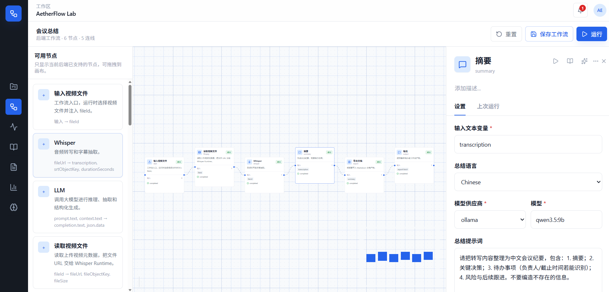

# Redag

> Enterprise AI workflow automation platform for turning files, prompts, models, tools, and notifications into reusable DAG pipelines.

[中文](README.md) | [Architecture](Architect.md) | [Common Contracts](docs/COMMON_CONTRACTS.md) | [Project Structure](docs/PROJECT_STRUCTURE.md)


## What It Is

Redag is built for enterprise AI automation. Users design DAG workflows in a visual canvas and connect file uploads, OCR, transcription, summarization, translation, model calls, data processing, task routing, and real-time notifications into traceable and reusable pipelines.

It is not just a chatbot or a pile of scripts. Redag acts as an AI-native orchestration layer: the frontend handles workflow design and runtime visibility, Java microservices handle identity, file governance, workflow definitions, task dispatch, AI orchestration, and notifications, while the Python service stays close to model inference and media processing.

## Preview



## Highlights

| Capability | Description |
| --- | --- |
| Visual DAG orchestration | A Vue Flow based canvas for composing files, models, prompts, and tool calls as workflow nodes. |
| File governance | File upload, chunk upload, MinIO object storage, metadata management, derived artifacts, and cache cleanup. |
| AI task execution | Java services coordinate runtime orchestration, RabbitMQ carries async tasks, and Python services adapt model and media workloads. |
| Real-time feedback | WebSocket and SSE streams report workflow status, node progress, and runtime errors. |
| Enterprise foundation | Spring Cloud Gateway, Nacos, Sentinel, Seata, Redis, MySQL, RabbitMQ, and MinIO provide the service backbone. |
| Deployable entrypoint | Nginx serves the frontend and proxies `/api`, `/ws`, and `/sse` to the gateway. |

## Example Workflows

- Document processing: upload PDF, Word, contracts, or reports; extract text; summarize; translate; polish; extract structured fields; export Markdown, tables, or review results.
- OCR automation: process scans, invoices, certificates, and image assets with text recognition, layout parsing, table restoration, validation, manual review, and archival.
- Meeting and media processing: upload audio or video; extract audio; transcribe with Whisper; generate minutes, action items, subtitles, and SRT files; stream progress updates.
- AI video generation: start from a topic, copy, or script; generate prompts; split storyboards; call image/video models; compose assets; transcode; review; notify.
- Reporting automation: import Excel, CSV, or business data; clean, classify, aggregate, visualize, write reports, and distribute them on schedule.
- Knowledge-base preparation: batch import documents, chunk content, summarize, tag, vectorize, quality-check, and prepare retrieval or QA datasets.

## Architecture

```text
                    +----------------------+
                    |      Web Console     |
                    | Vue 3 + Vue Flow     |
                    +----------+-----------+
                               |
                        Nginx / Gateway
                               |
        +----------------------+----------------------+
        |                      |                      |
  auth-service          workflow-service       notify-service
  JWT / OAuth           DAG definitions        WebSocket / SSE
        |                      |                      |
        +-----------+----------+-----------+----------+
                    |                      |
              file-service            task-service
        MinIO / metadata / cache       RabbitMQ tasks
                    |                      |
                    +----------+-----------+
                               |
                           ai-service
                 provider orchestration / node runtime
                               |
                       python-ai-service
             Whisper / OCR / media / model adapters
```

Runtime flow:

```text
User uploads files, assets, or workflow parameters
-> file-service stores MinIO objects and metadata
-> workflow-service creates workflow instances and parses DAGs
-> task-service records tasks and publishes RabbitMQ messages
-> ai-service consumes tasks and calls python-ai-service, model providers, or external tools by node type
-> file-service stores derived files and structured result metadata
-> notify-service pushes status through WebSocket/SSE
```

## Tech Stack

| Layer | Technology |
| --- | --- |
| Backend | Java 17, Maven, Spring Boot 3.2.12, Spring Cloud 2023.0.5, Spring Cloud Alibaba 2023.0.3.3 |
| Service governance | Gateway, Nacos, OpenFeign, Sentinel, Seata, Springdoc OpenAPI / Swagger |
| Data and middleware | MyBatis Plus, MySQL 8.0.26, Redis, RabbitMQ, MinIO, XXL-Job, Activiti BPM |
| AI and media | Spring AI, FastAPI, OpenAI SDK, Ollama SDK, faster-whisper, ctranslate2, torch, ffmpeg-python, pydub |
| Frontend | Vue 3, Vue Router 5, Pinia, Vite 8, TypeScript, Tailwind CSS, Vue Flow, Orval, lucide-vue-next |
| Deployment | Docker Compose, Nginx, WebSocket, SSE |

## Repository Layout

```text
backend/
  common/                 # Shared response, error, JWT, MQ event, DTO, and OpenAPI contracts
  gateway-service/        # API gateway
  auth-service/           # Authentication and identity
  workflow-service/       # Workflow definitions and instances
  task-service/           # Task records and message publishing
  ai-service/             # AI node orchestration and provider calls
  file-service/           # Files, object storage, and metadata governance
  notify-service/         # WebSocket / SSE notifications
  workflow-runtime-api/   # Workflow runtime contracts
frontend/                 # Vue 3 console
python-ai-service/        # Python AI inference and media processing service
ai-runtime/               # Local Windows demo runtime
docker/                   # Infrastructure configuration
performance-test/         # JMeter performance test scripts
docs/                     # Contracts, deployment, tasks, and architecture docs
docker-compose.yml
```

## Quick Start

### Requirements

- JDK 17
- Maven 3.9+
- Node.js 20+
- Docker Desktop / Docker Engine

### Local Build

```powershell
$env:JAVA_HOME = 'C:\Program Files\Microsoft\jdk-17.0.19.10-hotspot'
$env:Path = "$env:JAVA_HOME\bin;$env:Path"
mvn test
```

Frontend build:

```powershell
cd frontend
npm install
npm run build
```

### Start With Docker

```powershell
docker compose up -d --build
```

Default entrypoint:

```text
http://localhost
```

If local port 80 is already in use, update the root `.env` file:

```dotenv
NGINX_HTTP_PORT=8088
VITE_API_BASE=/api
VITE_WS_BASE=/ws
```

## Default Ports

| Service | Port |
| --- | --- |
| nginx | 80 |
| gateway-service | 8080 |
| auth-service | 8101 |
| workflow-service | 8102 |
| task-service | 8103 |
| ai-service | 8104 |
| file-service | 8105 |
| notify-service | 8106 |
| python-ai-service | 8200 |
| Nacos | 8848 |
| MySQL | 3307 -> 3306 |
| Redis | 6379 |
| RabbitMQ | 5672 / 15672 |
| MinIO | 9000 / 9001 |
| Seata | 8091 |

## Nginx Entrypoint

The production-style entrypoint is defined in `frontend/nginx/nginx.conf`. Nginx serves static frontend assets and reverse-proxies traffic; it does not replace Spring Cloud Gateway.

Routing rules:

| Path | Target |
| --- | --- |
| `/` and Vue Router history routes | `frontend/dist/index.html` |
| `/api/*` | `gateway-service:8080` |
| `/ws/*` | `gateway-service:8080` |
| `/sse/*` | `gateway-service:8080` |

`/api`, `/ws`, and `/sse` are deployment-layer prefixes and are stripped before forwarding. Business routes are still handled by Spring Cloud Gateway with backend paths such as `/auth`, `/workflows`, and `/notify`.

Health check:

```text
GET /health
```

## Service Health Checks

Every Java service exposes:

```text
GET /health
GET /actuator/health
```

The Python AI service exposes:

```text
GET /health
```

## Local Demo Runtime

`ai-runtime/` is a demo-machine toolkit, not a Nacos-registered microservice. It prepares models on a Windows development machine, validates CUDA / FFmpeg / Ollama workflows, and runs the local demo chain:

```text
video -> transcription -> summary -> SRT
```

The production business path still uses `python-ai-service/`; `ai-runtime/` does not replace it.

## Collaboration

Before cross-service collaboration, read [docs/COMMON_CONTRACTS.md](docs/COMMON_CONTRACTS.md). All microservices share the response envelope, error codes, JWT conventions, MQ events, DTOs, and OpenAPI contracts from `common`.

Recommended entry points:

- [Architect.md](Architect.md): architecture overview
- [docs/PROJECT_STRUCTURE.md](docs/PROJECT_STRUCTURE.md): repository layout
- [docs/COMMON_CONTRACTS.md](docs/COMMON_CONTRACTS.md): shared service contracts
- [docs/deployment/final-production-like-checklist.md](docs/deployment/final-production-like-checklist.md): production-like deployment checklist
